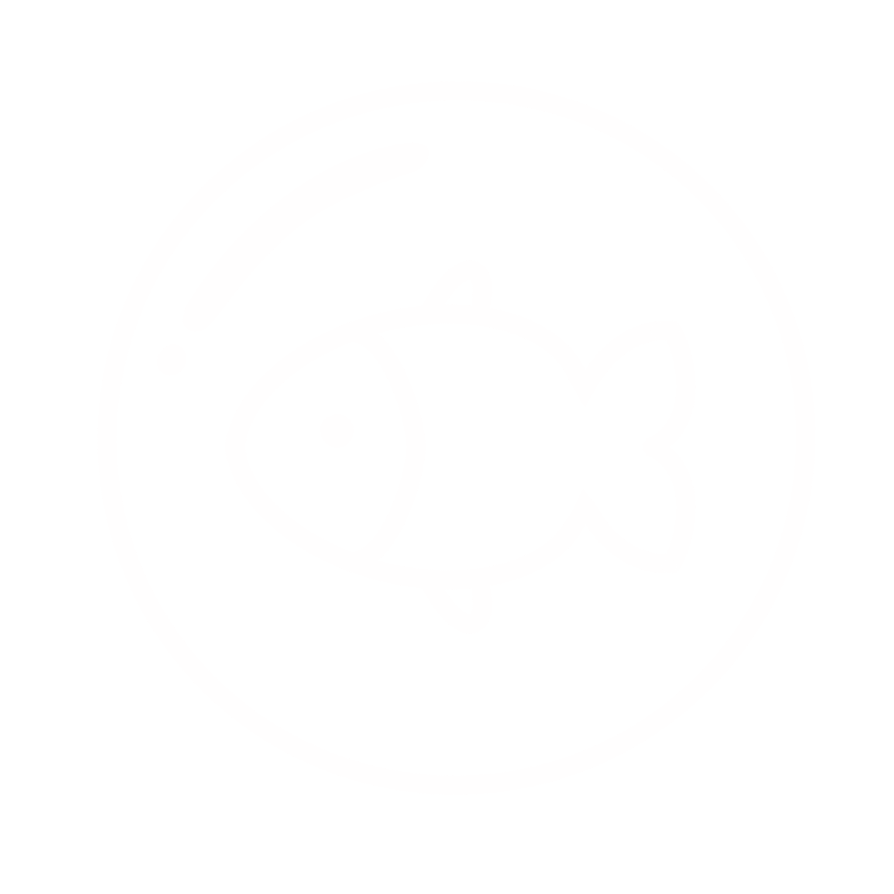
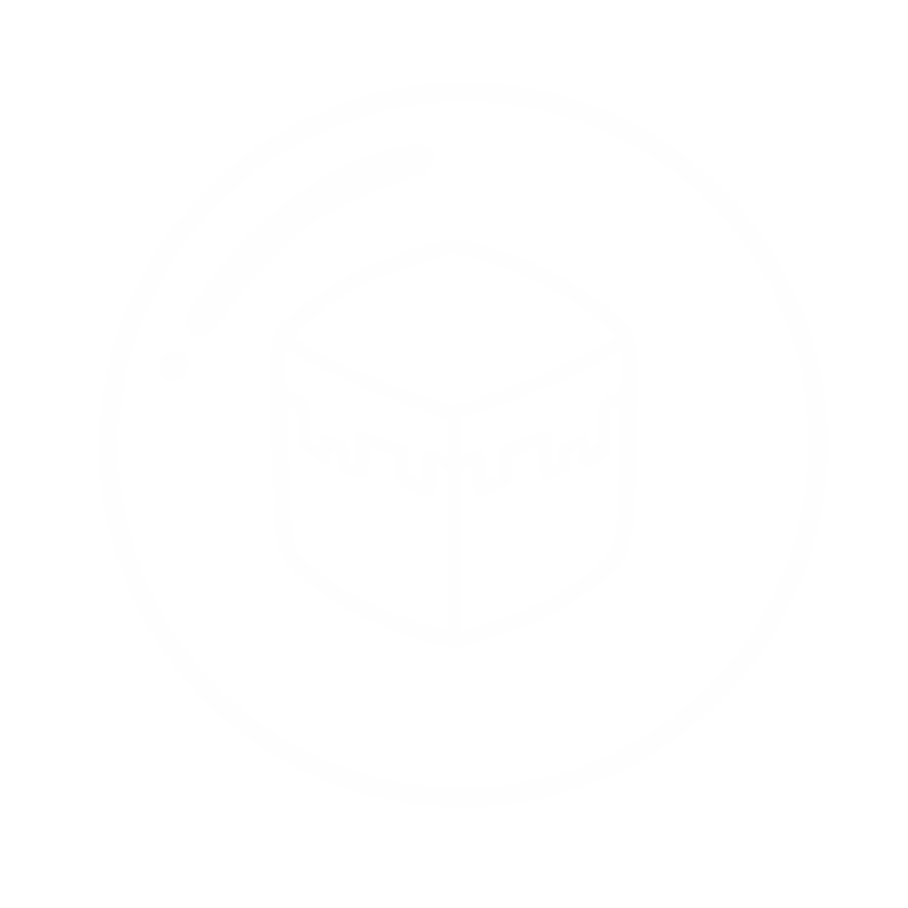

## Hi! Welcome to my Github!
About me:
  - Software Engeneering student
  - Neither frontend or backend, but a secret third thing
  - GPT Free since 2024!
  - Do not contact me
\
\
    #### “It is very easy to be blinded to the essential uselessness of their repos, by the sense of achievement you get from getting them to work at all. In other words—and this is the rock solid principle on which the whole of this github account's success is founded—their fundamental design flaws are completely hidden by their superficial design flaws.” - Douglas Adams, probably.
\
\

  
  

###

  
  
  
  
  
  
  
  
  

###

